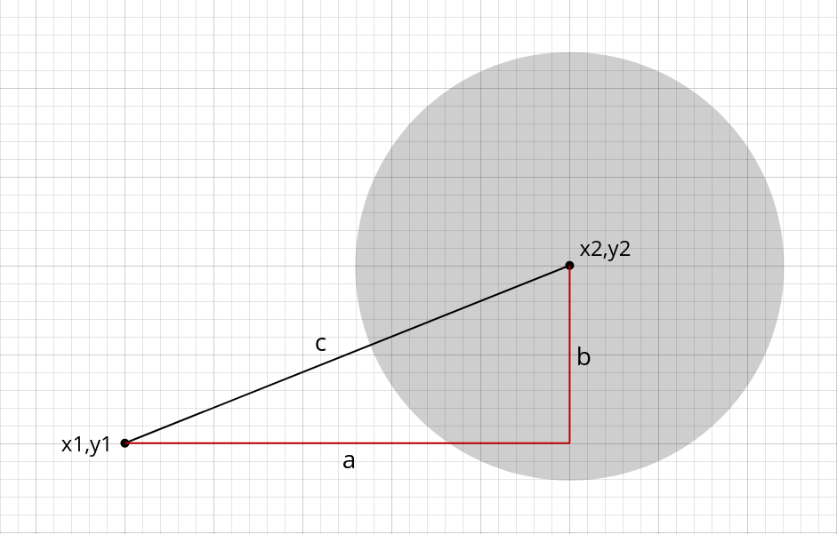

# Link station selection

## Running this project

To run this project you need node.js only. Dependency installation is not required.

Few npm scripts were added for convenience:
1. `npm start` runs `main.js`, script executing library functions against provided device and station data
2. `npm run test` runs library functions test suite
3. `npm run docs` runs jsdoc compiler on `lib` folder (docs are pre-rendered)

## How distance between device and station is calculated?

To find the link station with strongest signal we need to determine the distance between the device and station first.
What we know is coordinates of both objects (_x1,y1_ and _x2,y2_). We could use this information and Pythagorean Theorem 
to calculate distance.



First we need to calculate the length of _a_ and _b_. It's pretty straightforward as we just need to subtract coordinate
components of device and station.

```js
const a = x1 - x2;
const b = y1 - y2;
```

Now that we have both distances we could use them to calculate value of _c_, which is the distance between device and
station. We could do this by transforming the equation form (```c^2 = a^2 + b^2```) of Pythagorean Theorem.

```js
const c = Math.sqrt(Math.pow(a, 2) + Math.pow(b, 2));
```
